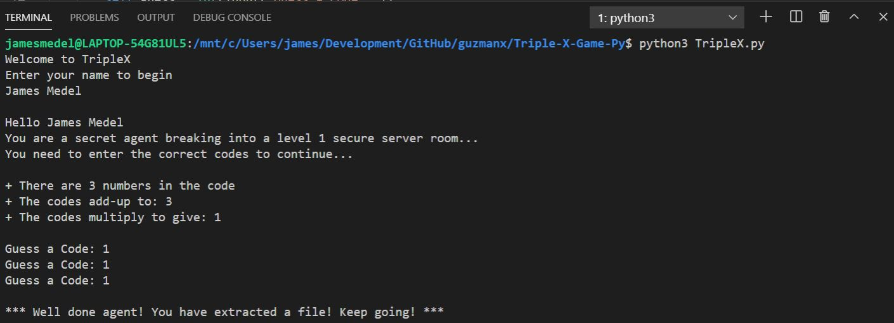

# Triple X Game Python

Number Puzzle Game, which involves hacking into a computer lock by finding a valid 3 number combination

## Story

You are a secret agent breaking into a LEVEL 2 server room.
Your SuperHacker 2000 tells you the following information

* There are 3 numbers in the code
* The codes multiply to give 18
* The codes add up to 8

As the player, we have to enter the 3 code numbers followed by x

**NOTE:** Once we successfully solve this first puzzle, then we will proceed to the next LEVEL with each LEVEL getting more difficult.

## Demo

~~~bash
python3 TripleX.py
~~~

